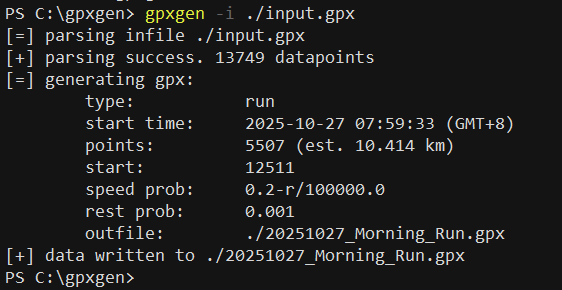
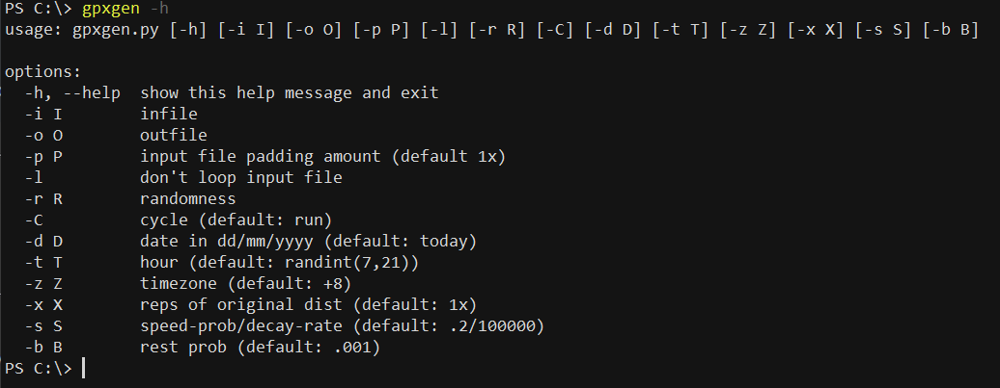

# gpxgen

This script manipulates gpx files. 

### Basic usage
Install requirements with `pip install -r requirements.txt`. Minimally, gpxgen needs a .gpx file to use as template. Pass the path to the input file via the `-i` argument

Gpxgen injests the input file, then generates a gpx file for a 10km run along the path of the input file. See next section for options.

If you intend to use the same template repeatedly, it may be convenient to hardcode the path to the input file in the first line of the script. The `-i` argument takes precedence over the `infile` variable.

### Options
Run `gpxgen -h` to see the other command line options.

|parameter|option|default value|explanation|
|---|---|---|---|
|outfile|`-o`|[YYYYmmdd]_[strava_default].gpx|pass this option to set the outfile path. must be a writable location|
|padding|`-p`|no pad|if `-p` is set, gpxgen interpolates 3 points between every pair of successive points in the input during processing. useful for converting bike rides to runs|
|loop|`-l`|no loop|if `-l` is set, gpxgen appends to the input a mirror copy of itself during processing, so that the route forms a loop. useful for avoiding discontinuities in the output route when it loops around (see `-K` below)|
|randomness|`-r`|1|value between 0 and 1. when generating the route, gpxgen randomly picks a starting point in the initial [randomness] of the input file. if set to 1, route starts at any point; if set to 0, route only starts at the starting point of the input route|
|activity type|`-C`|run|set `-C` to generate a cycling ride instead of a run|
|date|`-d`|current system date|date of the generated route. pass a date string in dd/mm/YYYY format|
|time|`-t`|random between 0700-2100|hour of the start time of the generated route (minute and second are random)|
|timezone|`-z`|+8|timezone of the date and time set in `-d` and `-t`. the time written to the output file will be adjusted to GMT. e.g., if you live in GMT+8 and want a run at 9am local time, set `-t 9 -z 8`. output file will write the start time as 1am (GMT), so that when uploaded to strava it shows as 9am local time|
|output distance|`-k`|10|use this option together with `-K`. this option sets the rough distance you want for the output route. gpxgen will randomly adjust by +/-.5km|
|input distance|`-K`|26|use this option together with `-k`. this option sets the distance for the input route. gpxgen generates a route with [output dist.]/[input dist.] as many points as the input (after possible padding). if the ratio is >1, the output route will loop around the input---be careful to make the input a loop if you want to allow this|
|speed probability|`-s`|.2/100000|pass in format `speed-prob/decay-rate`. to introduce variation, the `i`-th point generated will skip forward 1-3 points with probability `speed-prob - i/decay-rate`. to disable this feature, set `speed-prob=0`. the decay rate decreases the probability of a skip (i.e., decreases the average speed) as we go further into the route. to disable decay, set `decay-rate=-1`|
|rest probability|`-b`|.001|to introduce variation, a 1 min rest will be added between points with probability .001. to disable this feature, set `-b 0`|
